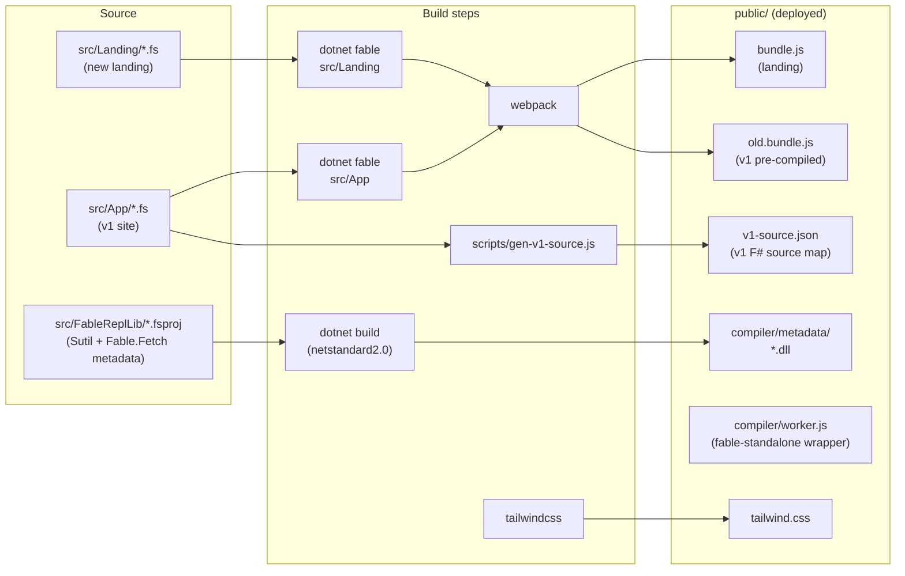
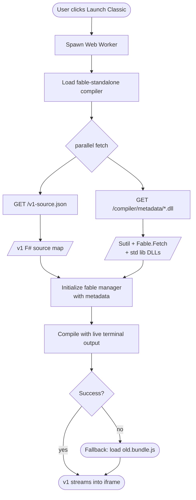
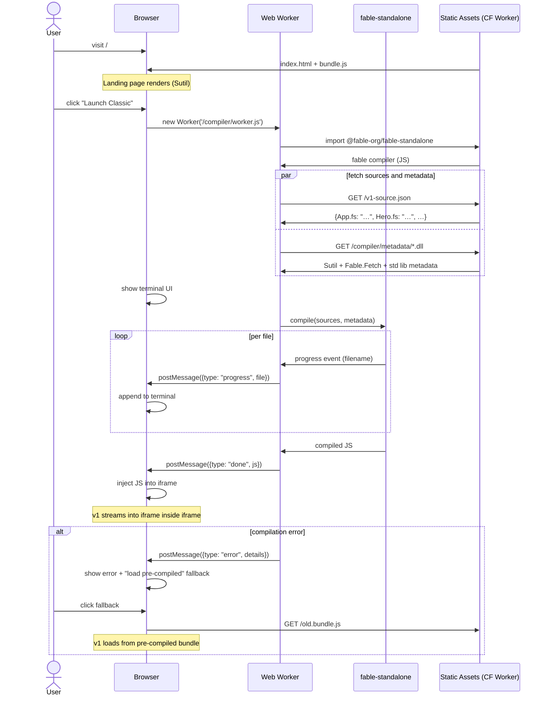

# Architecture

## Build-time pipeline

```mermaid
flowchart LR
    subgraph src["Source"]
        fs_app["src/App/*.fs\n(v1 site)"]
        fs_land["src/Landing/*.fs\n(new landing)"]
        fs_repl["src/FableReplLib/*.fsproj\n(Sutil + Fable.Fetch metadata)"]
    end

    subgraph build["Build steps"]
        fable_app["dotnet fable\nsrc/App"]
        fable_land["dotnet fable\nsrc/Landing"]
        dotnet_repl["dotnet build\n(netstandard2.0)"]
        gen["scripts/gen-v1-source.js"]
        webpack["webpack"]
        tailwind["tailwindcss"]
    end

    subgraph public["public/ (deployed)"]
        bundle["bundle.js\n(landing)"]
        old_bundle["old.bundle.js\n(v1 pre-compiled)"]
        v1_json["v1-source.json\n(v1 F# source map)"]
        meta["compiler/metadata/\n*.dll"]
        worker["compiler/worker.js\n(fable-standalone wrapper)"]
        css["tailwind.css"]
    end

    fs_app --> fable_app --> webpack
    fs_land --> fable_land --> webpack
    webpack --> bundle
    webpack --> old_bundle

    fs_app --> gen --> v1_json
    fs_repl --> dotnet_repl --> meta
    tailwind --> css
```

## Runtime: dynamic compilation pipeline

```mermaid
flowchart TD
    A([User clicks Launch Classic]) --> B[Spawn Web Worker]

    B --> C[Load fable-standalone compiler]

    C --> D{parallel fetch}
    D --> E[GET /v1-source.json]
    D --> F[GET /compiler/metadata/*.dll]

    E --> G[/v1 F# source map/]
    F --> H[/Sutil + Fable.Fetch\n+ std lib DLLs/]

    G --> I[Initialize fable manager\nwith metadata]
    H --> I

    I --> J[Compile with live terminal output]
    J --> N{Success?}

    N -->|yes| Q([v1 streams into iframe])
    N -->|no| T([Fallback: load old.bundle.js])
    T --> Q
```

## Runtime: dynamic compilation sequence

```mermaid
sequenceDiagram
    actor User
    participant Browser
    participant Worker as Web Worker
    participant Standalone as fable-standalone
    participant Assets as Static Assets (CF Worker)

    User->>Browser: visit /
    Assets->>Browser: index.html + bundle.js
    Note over Browser: Landing page renders (Sutil)

    User->>Browser: click "Launch Classic"
    Browser->>Worker: new Worker('/compiler/worker.js')
    Worker->>Assets: import @fable-org/fable-standalone
    Assets->>Worker: fable compiler (JS)

    par fetch sources and metadata
        Worker->>Assets: GET /v1-source.json
        Assets->>Worker: {App.fs: "…", Hero.fs: "…", …}
    and
        Worker->>Assets: GET /compiler/metadata/*.dll
        Assets->>Worker: Sutil + Fable.Fetch + std lib metadata
    end

    Browser->>Browser: show terminal UI
    Worker->>Standalone: compile(sources, metadata)

    loop per file
        Standalone->>Worker: progress event (filename)
        Worker->>Browser: postMessage({type: "progress", file})
        Browser->>Browser: append to terminal
    end

    Standalone->>Worker: compiled JS
    Worker->>Browser: postMessage({type: "done", js})
    Browser->>Browser: inject JS into iframe
    Note over Browser: v1 streams into iframe inside iframe

    alt compilation error
        Worker->>Browser: postMessage({type: "error", details})
        Browser->>Browser: show error + "load pre-compiled" fallback
        User->>Browser: click fallback
        Browser->>Assets: GET /old.bundle.js
        Note over Browser: v1 loads from pre-compiled bundle
    end
```
